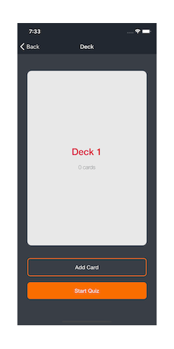
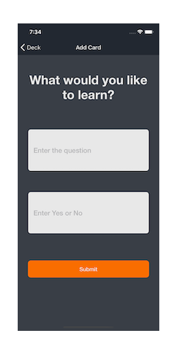
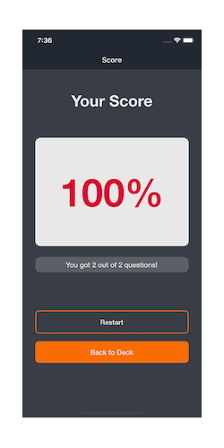

# Mobile Flashcards Project

This project is the final requirement for the React Nanodegree Program, by Udacity. It is also the final assessment project for the React Native course.

The project is a mobile application based on react-native and redux technologies.

It was created from [create-react-native-app](https://github.com/expo/create-react-native-app), and by using Expo to enable working with Components and APIs in react-native, as well as the JavaScript APIs that the are bundled with the Expo App.

### Platform:

_Developed and tested only for **iOS** platform._

## About Mobile Flashcards

**Mobile Flashcards project** is a mobile app that allows users to study collections of flashcards. The app will allow users to create different categories of flashcards called "decks", add flashcards to those decks, take quizzes on those decks and check their final score.

## Getting Started

Open the terminal and run the following commands:

```bash
$ yarn
$ yarn start
# Or
$ npm install
$ npm start
```

## Screens








## Storage

This project makes use of Redux as the single source of truth for state management, and also AsyncStorage to store decks and flashcards that are created.
